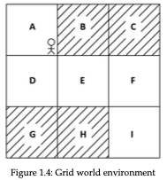

### CHAPTER 1 : FUNDAMENTALS OF REINFORCEMENT LEARNING
#### Topics 
1. Introduction to RL
2. Key Components of RL
3. How RL Algorithm works
4. Markov Decision Process(MDP)
5. Action Space
6. Policy
7. Episode
8.  Task
9.  Horizon
10. Discount Factor & Return

#### Introduction to RL
-  Reinforcement Learning is one of the area of Machine Learning.Unlike other ML paradiagram(Supervised & Unsupervised ML).
-  RL works by interacting with the evirionment.
  
#### Key Components of RL 
1. Agent : software programme, that makes intelligent decisions
2. Evironement : Environment is world of Agent.
3. Action : agent interact with the environemt by performing an action.
4. State : state is space in environement where the agent can be.
5. Reward : if the action is good(recives positive reward) & if action is bad (neg reward).

#### How RL Algorithm works 
step 1 : agent interact with the environment by performing an action.
step 2 : By performing an action, agent move from one state to another state.
step 3 : agenet receive reward based on the action, if action is good receives positive reward and else negative.

#### RL in Grid World Environement

- In the above mentioned gridworld environment the goal is to reach the state I from A with out reaching the shaded regions.
- Action A to B : bad action since B is a shaded grid
- Action A to D : good action since D is a non shaded grid

#### Markov Decision Process(MDP) 
- Markov Decision Process is a **mathematical framework** for solving the RL learning problems.
- It can be used to solve the optimization problems.
- Before understanding MDP, we should understand Markov chain & Markov Property
- Markov Property : according to markov property, future depends only on the present state not on the past.
(eg: if the climate is cloudy now, next would be rainy, depends only on the present state)
- Markov Chain / Markov Process : consists of a set of states that follows Markov Property.
- Transition Probability: change in state from one to another is called transition, the probability asosiated with the transition is known as transition probablity
- Ways to represent transition probability,
  1. Transition Table(Current state, Next state, probablity)
  2. State Diagram
  3. Transition Matrix
- Markov Process/ Markov Chain consists of states, transition probability p(s/s')
- **Markov Reward Process(MRP)** : MRP is an extension to the Markov chain/Markov Process with an addition of reward.
- MRP consists,
  1. States(s)
  2. Transition Probability : P(s/s')
  3. Reward : R(s)
- Markov Desision Process(MDP) is an extension to MRP with extension of actions.it consists,
  1. States(s)
  2. Action(a)
  3. Transition Probablity : P(s/s', a)
  4. Reward : R(s,a,s')

#### Action Space
- Action space : set of all the states that can be performed by an agent in an ebvironement is known as action space.
- Types of action space,
  1. Discrete Action Space : Action space consists of discrete no of actions
  2. Continous Action Space : Continous no of actions

#### Policy 
- policy : policy defines the behaviour of the agent.it determines what agent will perform next.
- Types of policy
  1. Determinstic policy : each state is mapped to a single action.
  2. Stochastic Policy : each state is mapped to a probability distribution over the action space.
- Stochastic policy can be classified in to,
  1. Categorical policy : if action space contains, discrete number of actions.
  2. Gaussian Policy : if action space contains, continous number of actions.

#### Episode 
- Episode : agent-environment interaction from the starting state to the ending state.
- also called trajectory

#### Task 
- Task in Reinforcement Learning can be classified into,
  1. Episodic task : agent has a final state/ terminal state(eg: grid world)
  2. Continous task : agent has no final / terminal state (eg : ai-bot assistant)
 
#### Horizon 
- Horizon : the time step at which agent interact with the environment.
- Types of Horizon,
  1. Finite Horizon : Agent-environment interaction stops at perticular time step.
  2. Infinite Horizon : Agent-environemtn interaction not stops at perticulat time steps.

#### Discount Factor & Return 
- Return(Episodic task) : return is the sum of rewards obtained by agent in an episode.
- Discount factor : additional parameter used for the calculation of Return in Contious task to avoid Return value reaching infinte.
- if Discount factor == 0 : only give importance to r0
- if Discount factor is very small : give more importance to imidiate reward than the future reward.
- if Discount factor is very high : give more importance to future rewards
- if Discount factor == 1 : Agent will learn for ever
